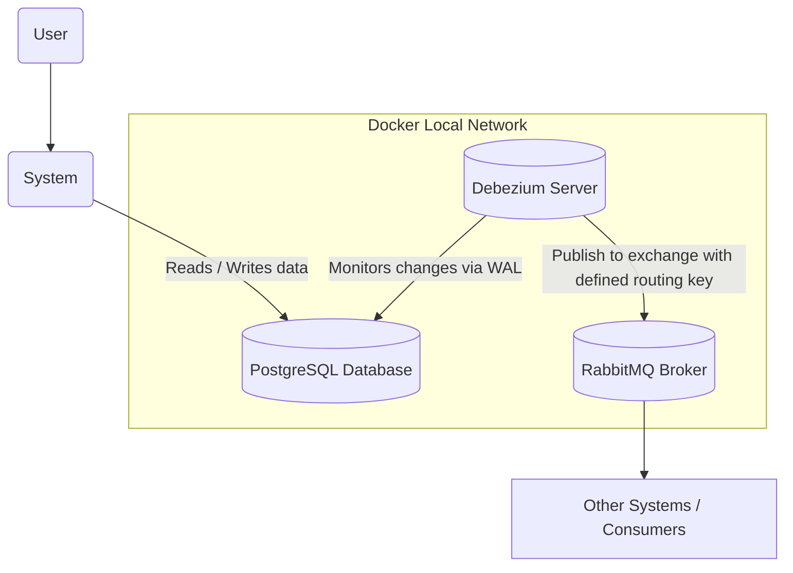
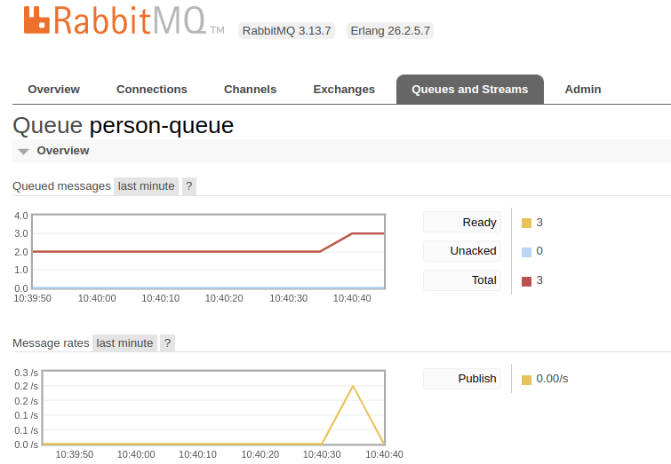

# Debezium CDC with Postgres and RabbitMQ (Docker Compose)

This project sets up a **Change Data Capture (CDC)** pipeline using:
- **PostgreSQL** (with `wal_level=logical` for CDC)
- **RabbitMQ** (as the message broker)
- **Debezium Server** (to capture DB changes and publish to RabbitMQ)

## 🛠 Services

| Service     | Purpose                         | Port                  |
|:------------|:---------------------------------|:----------------------|
| Postgres    | Source database for CDC          | 5442 (host) -> 5432    |
| RabbitMQ    | Message broker                   | 5672 (AMQP), 15672 (UI)|
| Debezium    | CDC Server publishing to RabbitMQ| 8080 (Debezium HTTP)   |


## Data Flow



## How to run

Start all containers

```
docker-compose up -d
```

Insert a new row into database.

```
./test.sh
```

## Check result

