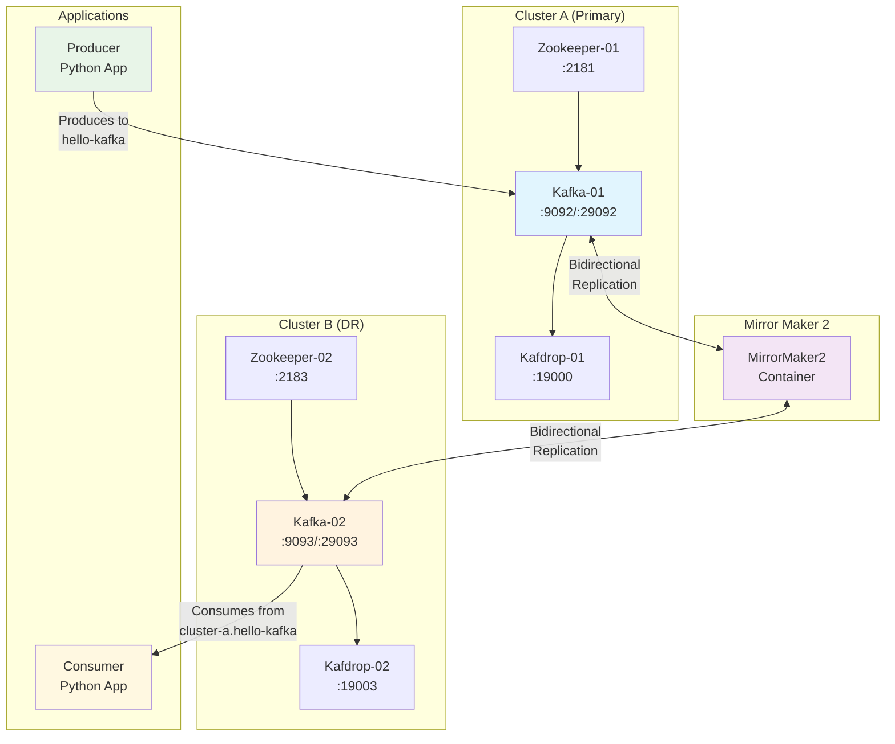

# Kafka Mirror Maker 2 - Disaster Recovery PoC

This project demonstrates a Proof of Concept (PoC) for Kafka cluster replication using Mirror Maker 2 (MM2) to simulate disaster recovery scenarios between two Kafka clusters.

## Architecture Overview



## Components

### Infrastructure
- **Cluster A (Primary)**: Kafka cluster with Zookeeper and Kafdrop UI
- **Cluster B (DR)**: Secondary Kafka cluster for disaster recovery
- **Mirror Maker 2**: Handles bidirectional replication between clusters
- **Kafdrop**: Web UI for monitoring Kafka topics and messages

### Applications
- **Producer**: Python application that sends messages to Cluster A
- **Consumer**: Python application that reads messages from Cluster A or Cluster B (DR) based on flag (**--failover_enabled**).

## Features

- **Bidirectional Replication**: Data flows both ways between clusters
- **Topic Pattern Matching**: Replicates all topics using regex pattern `.*`
- **Infinite Loop Prevention**: Excludes already replicated topics to prevent loops
- **Offset Synchronization**: Maintains consumer group offsets across clusters
- **Heartbeat Monitoring**: Tracks replication health
- **Checkpoint Management**: Ensures data consistency

## Quick Start

### Prerequisites
- Docker and Docker Compose
- Python 3.x (for running test applications)

### 1. Start the Infrastructure

```bash
# Start all services
docker-compose up -d

# Check service status
docker-compose ps
```

### 2. Verify Cluster Health

Access the Kafdrop UIs to monitor your clusters:
- **Cluster A**: http://localhost:19000
- **Cluster B**: http://localhost:19003

### 3. Run the Test Applications

Install Python dependencies:
```bash
cd apps/
python3 -m venv .env/
source .env/bin/activate
pip install -r requirements.txt
```

Start the producer (sends messages to Cluster A):
```bash
python producer.py
```

In another terminal, start the consumer (reads from Cluster A):
```bash
python consumer.py
```

## Configuration Details

### Mirror Maker 2 Configuration (`mm2.properties`)

```properties
# Define clusters
clusters = cluster-a, cluster-b

# Cluster endpoints
cluster-a.bootstrap.servers = kafka-01:29092
cluster-b.bootstrap.servers = kafka-02:29093

# Enable bidirectional replication
cluster-a->cluster-b.enabled = true
cluster-b->cluster-a.enabled = true

# Replicate all topics
cluster-a->cluster-b.topics = .*
cluster-b->cluster-a.topics = .*

# Prevent infinite loops
cluster-a->cluster-b.topics.exclude = cluster-b\..*
cluster-b->cluster-a.topics.exclude = cluster-a\..*

refresh.topics.interval.seconds = 30
```

### Topic Naming Convention

Mirror Maker 2 uses a specific naming convention for replicated topics:
- Original topic: `hello-kafka` (on cluster-a)
- Replicated topic: `cluster-a.hello-kafka` (on cluster-b)

## Data Flow

1. **Producer** sends messages to `hello-kafka` topic on **Cluster A**
2. **Mirror Maker 2** detects new messages and replicates them to **Cluster B**
3. **Consumer** reads messages from `cluster-a.hello-kafka` topic on **Cluster B** if failover is enabled
4. The process works bidirectionally for disaster recovery scenarios

## Monitoring

### Kafdrop Web UIs
- Monitor topics, partitions, and messages
- View consumer groups and their offsets
- Check replication lag and health

### Docker Logs
```bash
# View Mirror Maker 2 logs
docker logs mirrormaker2

# View all service logs
docker-compose logs -f
```

## Simulating a failover

```
python3 consumer.py --failover_enabled
```


## Cleanup

```bash
# Stop all services
docker-compose down

# Remove volumes (optional)
docker-compose down -v
```

## References

- [Apache Kafka Mirror Maker 2.0](https://kafka.apache.org/documentation/#georeplication)
- [Confluent Mirror Maker 2.0 Documentation](https://docs.confluent.io/platform/current/multi-dc-deployments/replicator/index.html)
