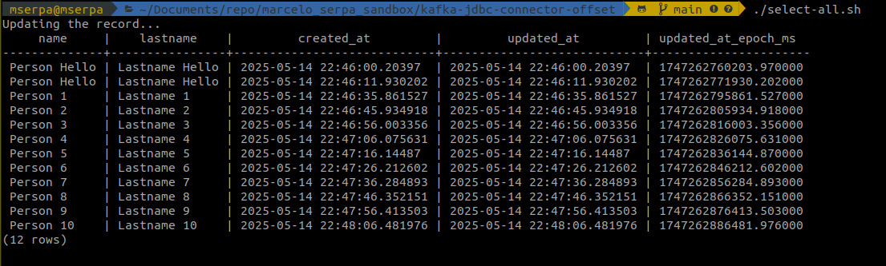
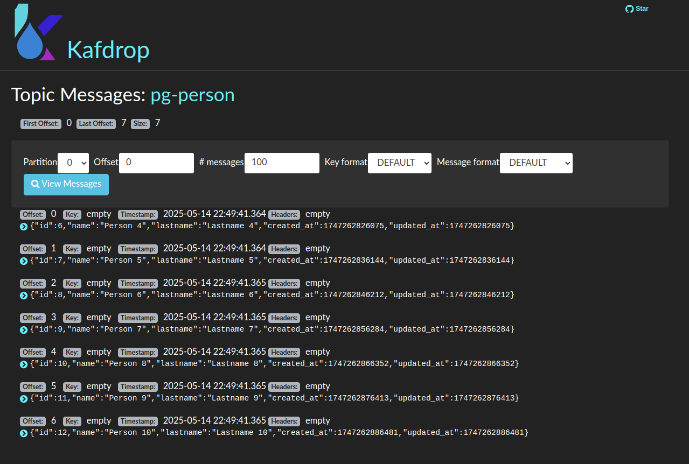

# Kafka JDBC Connector 


Simulating a database with pre-existent data.




Use **timestamp.initial** to previous rows. I this case start to read data from Person 4 the newest.


```json
{
    "name": "postgres-source-connector",
    "config": {
      "connector.class": "io.confluent.connect.jdbc.JdbcSourceConnector",
      "tasks.max": "1",
      "connection.url": "jdbc:postgresql://postgres:5432/products",
      "connection.user": "kafka",
      "connection.password": "kafka",
      "mode": "timestamp",
      "table.whitelist": "person",
      "timestamp.column.name": "updated_at",
      "timestamp.initial": 1747262826075,
      "topic.prefix": "pg-",
      "poll.interval.ms": 5000
    }
  }
```
Result:

