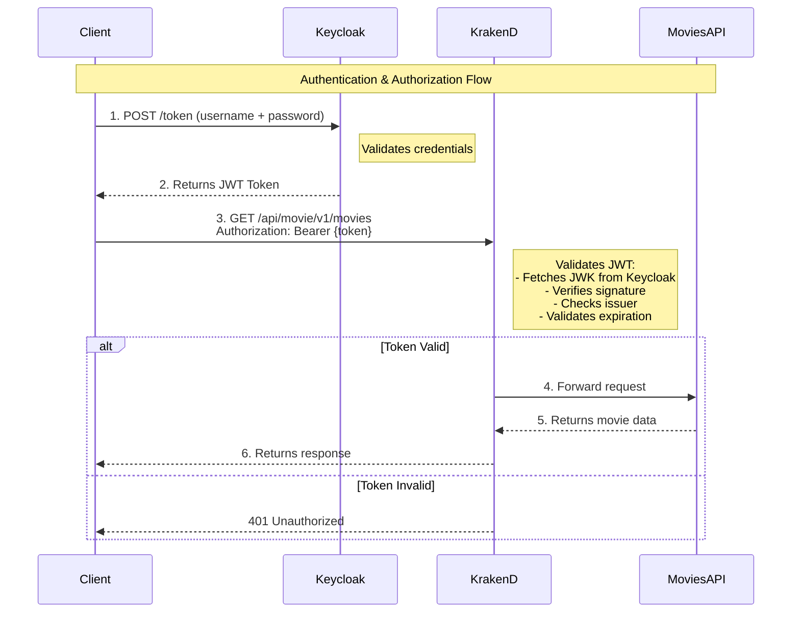
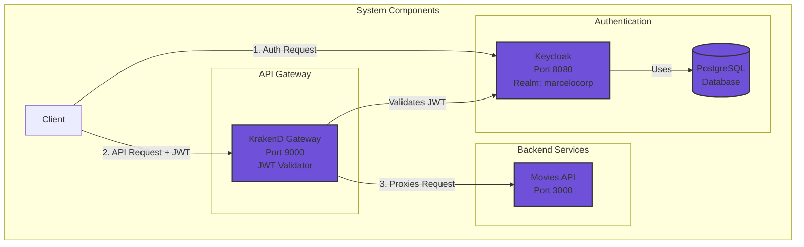

# KrakenD + Keycloak Integration

This POC aims to implement the authentication/authorization flows using Krakend as API Gateway and Keycloak as IdP.

## Architecture Overview



## System Components




## Keycloak Configuration

After starting the services, you need to configure Keycloak:

1. Access Keycloak admin console: http://localhost:8080
2. Login with credentials:
   - Username: `admin`
   - Password: `admin_password`
3. Create a realm named `marcelocorp`
4. Create a client named `movies-app`
5. Create a user named `marcelo` with password `marcelo`

## Running Tests

### 1. Get Authentication Token

```bash
# Run the authentication script
./scripts/auth-request.sh
```

This will return a JSON response with an `access_token`. Copy the token value.

**Example response:**
```json
{
  "access_token": "eyJhbGciOiJSUzI1NiIsInR5cCI6IkpXVCJ9...",
  "expires_in": 300,
  "token_type": "Bearer"
}
```

### 2. Make API Request with Token

```bash
# Use the token to call the movies API through KrakenD
./scripts/movies-api-request.sh "YOUR_ACCESS_TOKEN_HERE"
```

**Example:**
```bash
./scripts/movies-api-request.sh "eyJhbGciOiJSUzI1NiIsInR5cCI6IkpXVCJ9..."
```

**Expected response:**
```json
[
  {
    "title": "End Game"
  }
]
```

### 3. Test Without Token (Should Fail)

```bash
curl -X GET "http://localhost:9000/api/movie/v1/movies"
```

This should return a 401 Unauthorized error, demonstrating that the gateway is properly protecting the API.

## Endpoints

- **Keycloak Admin**: http://localhost:8080
- **Keycloak Token Endpoint**: http://localhost:8080/realms/marcelocorp/protocol/openid-connect/token
- **KrakenD Gateway**: http://localhost:9000
- **Movies API (via Gateway)**: http://localhost:9000/api/movie/v1/movies
- **Movies API (direct)**: http://localhost:3000/movie/v1/movies/
