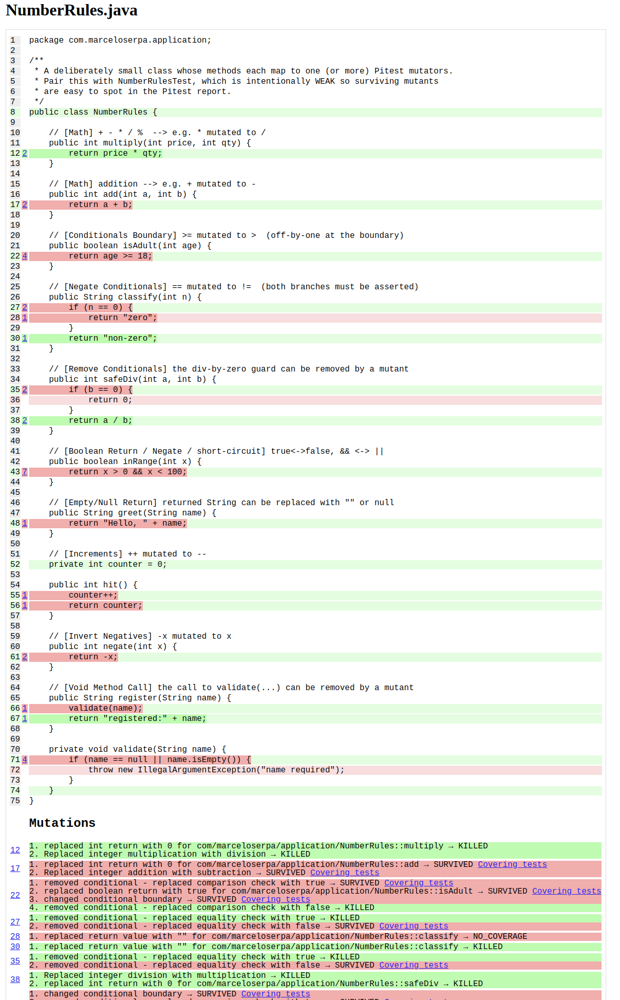

# Pitest


## Summary

- killed: the mutation broken the code and a unit test catch it.
- survived: no test catch this change
- not coverage: "strong" survived. no test coverage this line


## Execute

Run mutation tests:

```shell
./gradlew pitest
```

The report will be generated in this path: build/reports/pitest/index.html 



