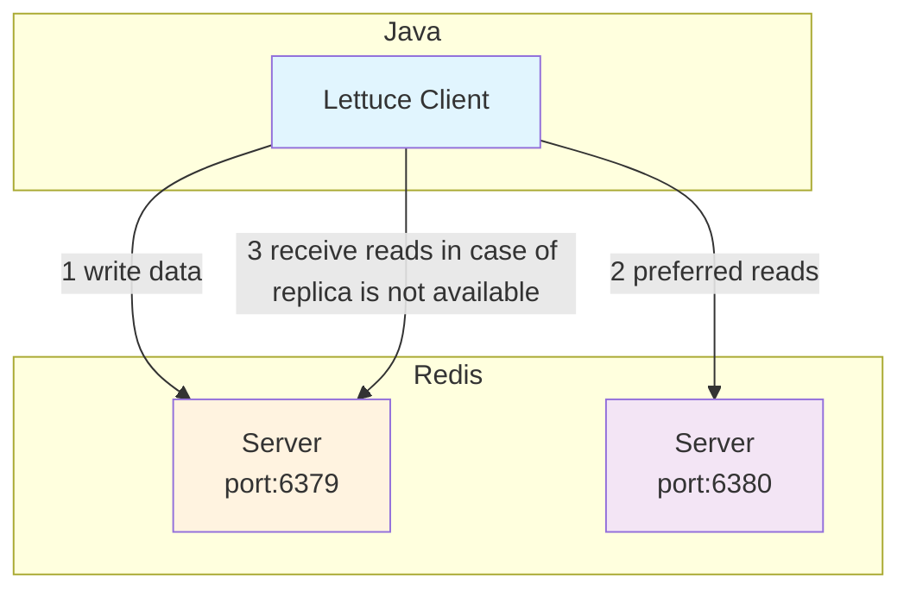

# Redis Master/Replica Lettuce Setup

## Architecture Overview

```mermaid
graph TB

    subgraph "Redis"
        MASTER[Server<br/>port:6379]
        REPLICA[Server<br/>port:6380]
    end

    subgraph "Java"
        CLIENT[Lettuce Client]
    end

    CLIENT -->|1 write data| MASTER
    CLIENT -->|2 preferred reads| REPLICA
    CLIENT -->|3 receive reads in case of replica is not available| MASTER

    style CLIENT fill:#e1f5fe
    style MASTER fill:#fff3e0
    style REPLICA fill:#f3e5f5

```
