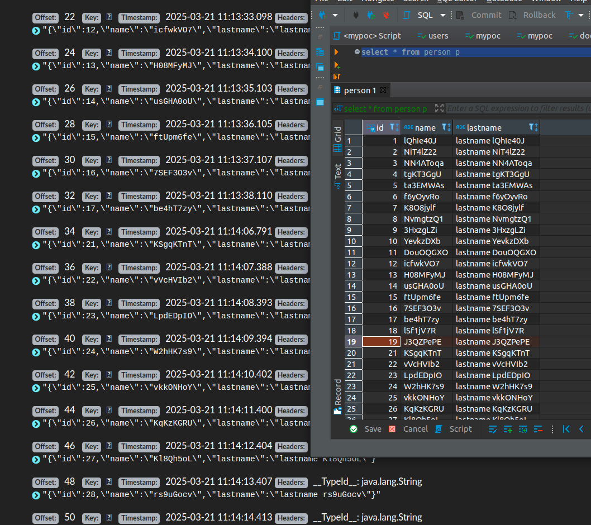

# Spring Transaction POC

**Objective:** Validate the behavior of Spring when a transaction between Kafka and PostgreSQL is in progress and a network failure occurs.

## Preparing the Application Environment

1. **Build the Java application:**
   ```bash
   ./gradlew clean build
   ```

2. **Start the containers for Kafka, Zookeeper, Kafdrop, and PostgreSQL:**
   ```bash
   docker-compose up -d
   ```

## Preparing the Failure Simulator Environment

1. **Navigate to the `failure-simulator` folder and create a virtual environment:**
   ```bash
   cd failure-simulator
   python3 -m venv .venv
   ```

2. **Install the required dependencies:**
   ```bash
   pip install -r requirements.txt
   ```

## Executing the Simulator

To run the failure simulation, execute the following command:
```bash
python simulator.py
```

## Checking the Results

After running the simulation, inspect the data in KafDrop and PostgreSQL. You should observe that events 18 and 19 were committed to PostgreSQL, but the event was not published to KafDrop.

