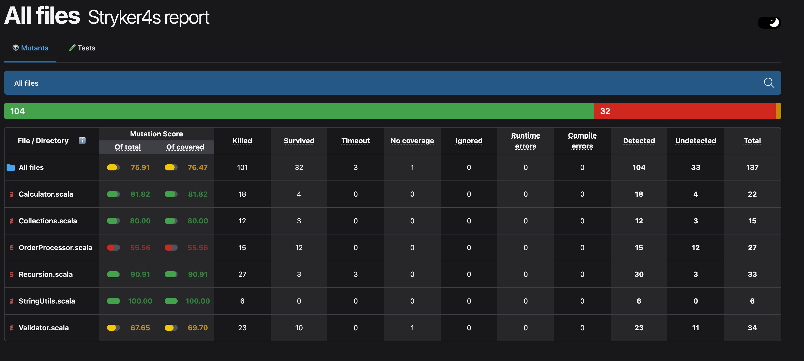
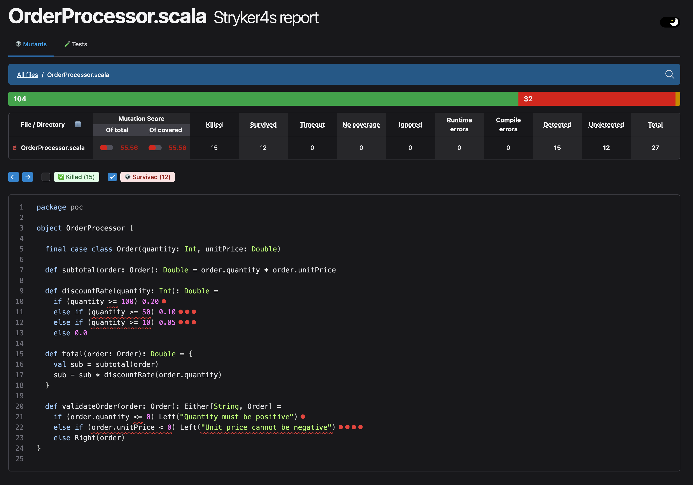

# stryker4s-poc

## Prerequisites

This repo uses SDKMAN:

- Java 25.0.3-amzn (Corretto)
- sbt 1.11.7

use this commands to load the env:

```sh
sdk env install 
sdk env
```

## Running the tests

```sh
sbt test
```

## Running Stryker4s

```sh
sbt stryker
```

This generates mutants for everything under `src/main/scala`, reruns the test suite against each mutant, and
prints a summary plus an HTML report at:

```
target/stryker4s-report/<timestamp>/index.html
```

Open it with:

```sh
open target/stryker4s-report/*/index.html
```

Mutation behavior is configured in [`stryker4s.conf`](./stryker4s.conf).

## Project layout

```
src/main/scala/poc/
  Calculator.scala 
  StringUtils.scala
  Collections.scala
  Recursion.scala
  Validator.scala
  OrderProcessor.scala

src/test/scala/poc/
```

Results



Details:


